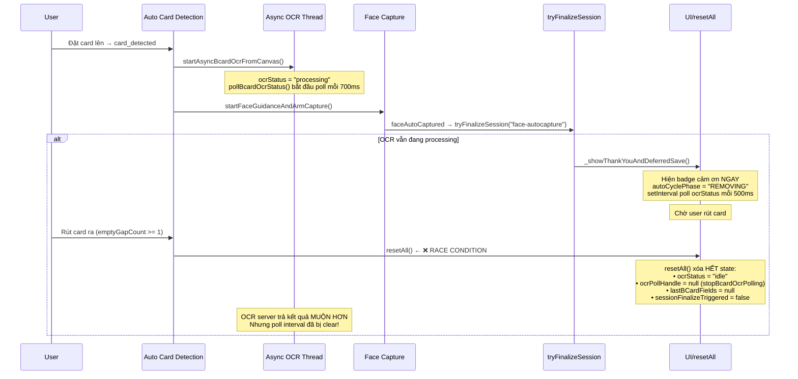

# Phân Tích: Dữ liệu không được lưu vào database khi rút card

## Tóm tắt vấn đề

Khi user đã capture card + face xong → badge cảm ơn hiện → user rút card → [resetAll()](file:///t:/bamboo_nissin/static/js/mainpy.js#2153-2251) được gọi → trở về màn hình đôi mắt → **dữ liệu mất, không lưu vào DB**.

## Phân tích luồng chạy (Timeline)



## Nguyên nhân gốc (Root Cause)

Có **2 race conditions** xảy ra đồng thời:

### Race Condition 1: [resetAll()](file:///t:/bamboo_nissin/static/js/mainpy.js#2153-2251) hủy OCR poll trước khi OCR xong

Tại [line 2155](file:///t:/bamboo_nissin/static/js/mainpy.js#L2155):
```javascript
async function resetAll() {
    stopBcardOcrPolling();   // ← Hủy interval polling OCR status!
    // ...
    state.ocrStatus = "idle";       // ← Reset trạng thái OCR
    state.ocrTaskId = null;         // ← Mất task ID
    state.lastBCardFields = null;   // ← Mất dữ liệu OCR đã nhận
}
```

Khi [_showThankYouAndDeferredSave](file:///t:/bamboo_nissin/static/js/mainpy.js#1253-1296) tạo `setInterval` chờ `ocrStatus === "done"` (line 1276-1291), nhưng [resetAll](file:///t:/bamboo_nissin/static/js/mainpy.js#2153-2251) đã:
1. Gọi [stopBcardOcrPolling()](file:///t:/bamboo_nissin/static/js/mainpy.js#1175-1181) → hủy interval poll OCR status từ server
2. Set `ocrStatus = "idle"` → deferred-save interval không bao giờ thấy `"done"`
3. Set `lastBCardFields = null` → kể cả nếu check được thì data cũng đã mất

### Race Condition 2: Card removal quá nhanh khi `emptyGapRequired = 1`

Tại [line 49](file:///t:/bamboo_nissin/static/js/mainpy.js#L49):
```javascript
emptyGapRequired: 1,  // Chỉ cần 1 frame trống là reset!
```

Chỉ cần **1 frame** không thấy card → [resetAll()](file:///t:/bamboo_nissin/static/js/mainpy.js#2153-2251). Với `cardAutoFps: 3` (mỗi ~333ms 1 frame), user chỉ cần rút card ~330ms là trigger reset, **trong khi OCR thread thường mất 2-5 giây**.

### Flow chi tiết khi xảy ra bug

1. **Card detected** → `state.autoCyclePhase = "CARD"` → [lockScanCam1](file:///t:/bamboo_nissin/static/js/mainpy.js#659-664) → [startAsyncBcardOcrFromCanvas](file:///t:/bamboo_nissin/static/js/mainpy.js#1336-1362) → `ocrStatus = "processing"`
2. **Face captured** → [tryFinalizeSessionAfterFaceAndOcr("face-autocapture")](file:///t:/bamboo_nissin/static/js/mainpy.js#1219-1252)
3. Vì `ocrStatus === "processing"` → vào [_showThankYouAndDeferredSave()](file:///t:/bamboo_nissin/static/js/mainpy.js#1253-1296)
4. Badge cảm ơn hiện → `autoCyclePhase = "REMOVING"` → `emptyGapCount = 0`
5. Auto card detection loop tiếp tục chạy → gửi frame với `check_only=true`
6. User rút card → `emptyGapCount >= 1` (line 1048) → **[resetAll()](file:///t:/bamboo_nissin/static/js/mainpy.js#2153-2251) được gọi**
7. [resetAll()](file:///t:/bamboo_nissin/static/js/mainpy.js#2153-2251) xóa tất cả: [stopBcardOcrPolling()](file:///t:/bamboo_nissin/static/js/mainpy.js#1175-1181), `ocrStatus = "idle"`, `lastBCardFields = null`
8. Deferred-save interval (line 1276) vẫn chạy nhưng:
   - `state.ocrStatus` đã bị set thành `"idle"` → không bao giờ `=== "done"`
   - Poll OCR status từ server đã bị hủy → không ai cập nhật `ocrStatus` nữa
   - Sau 30s timeout, interval tự clear → **DATA LOST**

## Vì sao luồng "OCR done trước khi rút card" vẫn hoạt động?

Nếu OCR xong **trước** khi user rút card:
1. [pollBcardOcrStatus](file:///t:/bamboo_nissin/static/js/mainpy.js#1297-1335) nhận `status === "done"` → `state.ocrStatus = "done"`
2. [tryFinalizeSessionAfterFaceAndOcr("ocr-done")](file:///t:/bamboo_nissin/static/js/mainpy.js#1219-1252) → [handleRegister()](file:///t:/bamboo_nissin/static/js/mainpy.js#2253-2262) → [sendPayloadToPython()](file:///t:/bamboo_nissin/static/js/mainpy.js#758-805) → [_saveRegistrationInBackground()](file:///t:/bamboo_nissin/static/js/mainpy.js#734-757) → **lưu DB thành công**
3. Sau đó user rút card → [resetAll()](file:///t:/bamboo_nissin/static/js/mainpy.js#2153-2251) → lúc này data đã lưu rồi, không vấn đề

> [!CAUTION]
> Bug chỉ xảy ra khi **OCR chưa xong** tại thời điểm rút card, tức là thứ tự: card capture → face capture → badge cảm ơn → rút card → (OCR vẫn đang chạy)

## Đề xuất hướng fix

### ✅ Option A: [resetAll](file:///t:/bamboo_nissin/static/js/mainpy.js#2153-2251) không xóa deferred-save context
Khi [resetAll](file:///t:/bamboo_nissin/static/js/mainpy.js#2153-2251) được gọi trong phase `REMOVING`, giữ lại OCR poll và deferred-save interval. Reset UI nhưng giữ data pipeline chạy ngầm.

### Option B: Lưu data ngay khi có face (optimistic save, cập nhật OCR sau)
Khi face captured + OCR processing → lưu registration ngay với data hiện có (chưa có OCR). Khi OCR xong → update registration đã lưu.

### ~~Option C~~ ❌: Delay [resetAll](file:///t:/bamboo_nissin/static/js/mainpy.js#2153-2251) cho đến khi deferred-save hoàn tất
Loại bỏ.

---

## Option A: Edge Case — User mới đưa card vào khi OCR cũ chưa xong

### Kịch bản

```
T=0s   User A đặt card → OCR bắt đầu (processing)
T=2s   User A chụp face → badge cảm ơn → phase REMOVING
T=3s   User A rút card → resetAll() → về đôi mắt
       ┌── Background: OCR poll + deferred-save vẫn chạy ngầm ──┐
T=5s   │ User B đặt card MỚI → card_detected                    │
       │ → startAsyncBcardOcrFromCanvas() cho card B              │
T=6s   │ OCR cũ (User A) xong → deferred-save lưu payload A ✅   │
       │ → dùng state.lastBCardFields (lúc này đã bị ghi đè bởi  │
       │   session B?) ← ⚠️ CONFLICT                             │
       └──────────────────────────────────────────────────────────┘
```

### Vấn đề cốt lõi

Background deferred-save đọc `state.lastBCardFields` và [buildScannedPayload()](file:///t:/bamboo_nissin/static/js/mainpy.js#720-733) **tại thời điểm OCR xong**, không phải tại thời điểm capture ban đầu. Nếu user B đã bắt đầu session mới:

| State field | Giá trị mong đợi (User A) | Giá trị thực tế (đã bị ghi đè bởi User B) |
|---|---|---|
| `lastBCardFields` | OCR result của card A | Có thể đã bị reset hoặc ghi đè bởi card B |
| `faceDataUrl` | Ảnh mặt User A | Ảnh mặt User B (nếu đã capture) |
| `bcardImageDataUrl` | Ảnh card A | Ảnh card B |

→ **Kết quả:** Payload lưu vào DB có thể là hỗn hợp data A + B, hoặc hoàn toàn sai.

### Giải pháp: Snapshot payload + Session ID

Khi vào [_showThankYouAndDeferredSave()](file:///t:/bamboo_nissin/static/js/mainpy.js#1253-1296), **snapshot toàn bộ data cần lưu ngay** (trừ OCR fields chưa có), lưu vào biến local (không phải `state`). Background poll chỉ cần chờ OCR result rồi merge vào snapshot đó, không đọc `state` global nữa.

```
Cách hoạt động:
1. Khi vào _showThankYouAndDeferredSave():
   - Tạo sessionId = random ID
   - snapshot = { faceDataUrl, bcardImageDataUrl, formData, ... } ← copy ngay
   - Lưu ocrTaskId hiện tại vào biến local

2. Khi resetAll():
   - Reset UI + state bình thường (KHÔNG cancel background save)
   - State sạch sẽ cho user mới

3. Background poll (dùng biến local, KHÔNG đọc state):
   - Poll trực tiếp: GET /api/ocr/bcard_async/status/{savedTaskId}
   - Khi OCR done → merge fields vào snapshot → _saveRegistrationInBackground(snapshot)
   - Không ảnh hưởng state hiện tại của session mới
```

> [!IMPORTANT]
> **Trên Raspberry Pi:** Giải pháp này chỉ giữ 1 `setInterval` nhỏ (~700ms/lần, 1 HTTP GET nhẹ) chạy tối đa 30s. Không ảnh hưởng CPU/RAM. Không conflict với session mới vì dùng biến local closure, không đụng vào `state` global.

